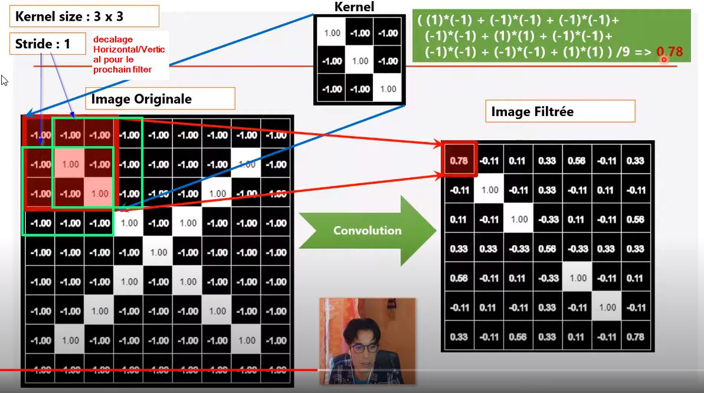
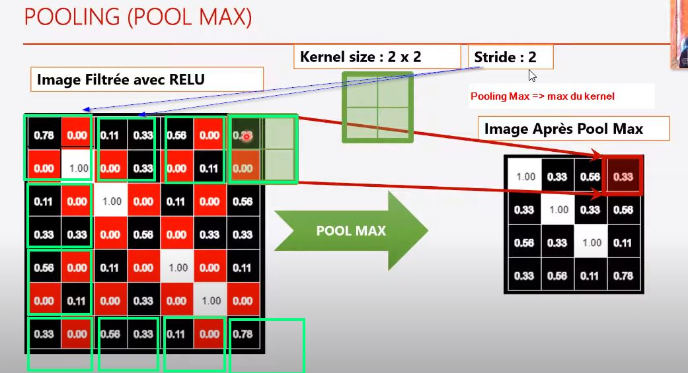
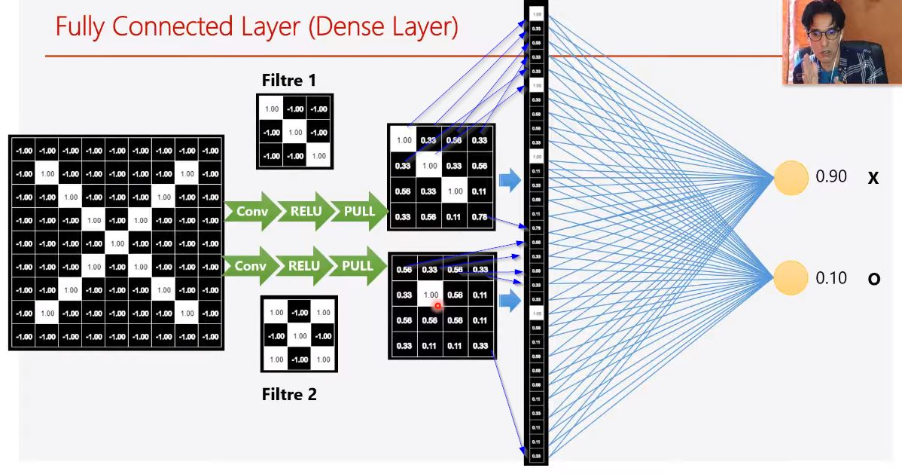

# prediction des chiffres de 0 à 9

# deziper le fichier mnist_png.tar.gz

le nom dossier défini le nom de la classe.  exemple dossier "0" pour définir la classe "0"

Pour utiliser CUDA il faut avoir des cartes Graphique de NVIDEA


 ## Couche convolution


## Fonction d'activation "Relu"


## Pooling max


##fully coonnected layer ( Dense layer)



## layer 


## java programme
````java
package deeplearning4j_CNN;

import java.io.File;
import java.io.IOException;
import java.util.Random;
import java.util.Scanner;

import org.datavec.api.io.labels.ParentPathLabelGenerator;
import org.datavec.api.io.labels.PathLabelGenerator;
import org.datavec.api.records.reader.RecordReader;
import org.datavec.api.records.reader.impl.csv.CSVRecordReader;
import org.datavec.api.split.FileSplit;
import org.datavec.image.loader.NativeImageLoader;
import org.datavec.image.recordreader.ImageRecordReader;
import org.deeplearning4j.core.storage.StatsStorage;
import org.deeplearning4j.datasets.datavec.RecordReaderDataSetIterator;
import org.deeplearning4j.nn.conf.MultiLayerConfiguration;
import org.deeplearning4j.nn.conf.NeuralNetConfiguration;
import org.deeplearning4j.nn.conf.inputs.InputType;
import org.deeplearning4j.nn.conf.layers.ConvolutionLayer;
import org.deeplearning4j.nn.conf.layers.DenseLayer;
import org.deeplearning4j.nn.conf.layers.OutputLayer;
import org.deeplearning4j.nn.conf.layers.SubsamplingLayer;
import org.deeplearning4j.nn.conf.layers.SubsamplingLayer.PoolingType;
import org.deeplearning4j.nn.multilayer.MultiLayerNetwork;
import org.deeplearning4j.ui.api.UIServer;
import org.deeplearning4j.ui.model.stats.StatsListener;
import org.deeplearning4j.ui.model.storage.InMemoryStatsStorage;
import org.deeplearning4j.util.ModelSerializer;
import org.nd4j.common.io.ClassPathResource;
import org.nd4j.evaluation.classification.Evaluation;
import org.nd4j.linalg.activations.Activation;
import org.nd4j.linalg.api.ndarray.INDArray;
import org.nd4j.linalg.dataset.DataSet;
import org.nd4j.linalg.dataset.api.iterator.DataSetIterator;
import org.nd4j.linalg.dataset.api.preprocessor.DataNormalization;
import org.nd4j.linalg.dataset.api.preprocessor.ImagePreProcessingScaler;
import org.nd4j.linalg.learning.config.Adam;
import org.nd4j.linalg.lossfunctions.LossFunctions;

import EDU.oswego.cs.dl.util.concurrent.Channel;

public class CNNModelMnist {

	private final static int BACK_AND_WHITE_COLOR_IMAGE = 1;
	private final static int RGB_COLOR_IMAGE = 3;
	private final static int PIXEL_IN = 28;

	private final static int COUNT_NUMBER_IMAGES = 10; // 0 à 9
	
	private final static int PIXEL_OUT_LAYER0 = 20;
	private final static int PIXEL_OUT_LAYER2 = 50;
	
	private final static int KERNEL_FILTER_LAYER0 = 5; // 5*5
	private final static int KERNEL_FILTER_LAYER1 = 2; // 2*2
	private final static int KERNEL_FILTER_LAYER2 = 5; // 5*5
	private final static int KERNEL_FILTER_LAYER3 = 2; // 2*2

	private final static int DECALAGE_HORZ_VERT_LAYER0 = 1; // horizontal et vertical Convolution
	private final static int DECALAGE_HORZ_VERT_LAYER1 = 2; // horizontal et vertical max Pooling
	private static final int DECALAGE_HORZ_VERT_LAYER2 = 1; // horizontal et vertical Convolution
	private final static int DECALAGE_HORZ_VERT_LAYER3 = 2; // horizontal et vertical max Poolingl
	private static final int LABEL_IMAGE = 0;
	private static final int LABEL_INDEX = 1;

	
	public static void main(String[] args) throws Exception {
		

	 long seed = 1234; // random int
	 double learningRate = 0.001;

	 long depth = BACK_AND_WHITE_COLOR_IMAGE;
	 long height = PIXEL_IN;
	 long width = PIXEL_IN;
	 int stride0 = DECALAGE_HORZ_VERT_LAYER0;
	 int stride1 = DECALAGE_HORZ_VERT_LAYER1;
	 int stride2 = DECALAGE_HORZ_VERT_LAYER2;
	 int stride3 = DECALAGE_HORZ_VERT_LAYER3;


	 
		MultiLayerConfiguration configuration = new NeuralNetConfiguration.Builder().seed(seed) // same random long number
				.updater(new Adam(learningRate)).list().setInputType(InputType.convolutionalFlat(height, width, depth))
				.layer(0, new ConvolutionLayer.Builder()
						.nIn(depth)
						.nOut(PIXEL_OUT_LAYER0)  
						.activation(Activation.RELU)
						.kernelSize(KERNEL_FILTER_LAYER0,KERNEL_FILTER_LAYER0)
						.stride(stride0,stride0)
						.build()
						) //
				.layer(1, new SubsamplingLayer.Builder()
						.poolingType(PoolingType.MAX)
						.kernelSize(DECALAGE_HORZ_VERT_LAYER1,DECALAGE_HORZ_VERT_LAYER1)
						.stride(stride1,stride1)
						.build()) //
				.layer(2, new ConvolutionLayer.Builder()
						.nOut(PIXEL_OUT_LAYER2)  
						.activation(Activation.RELU)
						.kernelSize(KERNEL_FILTER_LAYER2,KERNEL_FILTER_LAYER2)
						.stride(stride2,stride2)
						.build()) //
				.layer(3, new SubsamplingLayer.Builder()
						.poolingType(PoolingType.MAX)
						.kernelSize(KERNEL_FILTER_LAYER3,KERNEL_FILTER_LAYER3)
						.stride(stride3,stride3)
						.build()) //
	        	.layer(4,new DenseLayer.Builder()
			        	.nOut(500)
				        .activation(Activation.RELU)
				        .build()) //
		        .layer(5,new OutputLayer.Builder()
				        .nOut(COUNT_NUMBER_IMAGES)
				        .activation(Activation.SOFTMAX)
				        .lossFunction(LossFunctions.LossFunction.NEGATIVELOGLIKELIHOOD)
				        .build()) //
		.build();

		
		MultiLayerNetwork model = new MultiLayerNetwork(configuration);
		model.init();
		
		// affiche le model
		System.out.println(configuration.toJson());
		
		
		
		System.out.println("----------------------------------------");
		System.out.println("CREATE UI SERVER");
				
		UIServer uiServer = UIServer.getInstance();
		StatsStorage  inMemoryStatsStorage= new InMemoryStatsStorage();
		uiServer.attach(inMemoryStatsStorage);
		
		model.setListeners(new StatsListener(inMemoryStatsStorage));
		
		
		
		System.out.println("----------------------------------------");
		System.out.println("ENTRAINEMENT DU MODEL");


		String path="./mnist_png";
		File fileTrain = new File(path+"/training");
		FileSplit fileSplitTrain=new FileSplit(fileTrain,NativeImageLoader.ALLOWED_FORMATS,new Random(seed));
		
		
		// dataVec pour la vectorisation des données image. L'image porte le nom du dossier
		RecordReader recordReaderTrain = new ImageRecordReader(height,width,depth,new ParentPathLabelGenerator() );
		
		recordReaderTrain.initialize(fileSplitTrain);
		
		int batchSize=100;
		DataSetIterator dataSetIteratorTrain=new RecordReaderDataSetIterator(recordReaderTrain, batchSize,LABEL_INDEX,COUNT_NUMBER_IMAGES) ;

		// normalisation des données. ramene les valeurs de chaque pixels entre 0 et 1  
		DataNormalization scaler= new ImagePreProcessingScaler(0, 1);
				
		dataSetIteratorTrain.setPreProcessor(scaler);		
			
		
		/*
		while( dataSetIteratorTrain.hasNext()) {
			DataSet dataSet = dataSetIteratorTrain.next() ; 
			
			INDArray features = dataSet.getFeatures();
			INDArray labels = dataSet.getLabels();
			
			System.out.println("---------------------------");
			System.out.println(features.shapeInfoToString());
			System.out.println(labels.shapeInfoToString());
			System.out.println(labels);
			
		}
		*/
		
		
		// demande de rejouer 100 fois le batchsize
				int numberEpoch = 2;
				for (int i = 0; i < numberEpoch ; i++) {
					model.fit(dataSetIteratorTrain);
				}
				 
			

		System.out.println("----------------------------------------");
		System.out.println("VALIDATION DU MODEL PAR SERIE TEST");
			
		
		
		File fileTest = new File(path+"/testing");
		FileSplit fileSplitTest=new FileSplit(fileTest,NativeImageLoader.ALLOWED_FORMATS,new Random(seed));
		
		
		// dataVec pour la vectorisation des données image. L'image porte le nom du dossier
		RecordReader recordReaderTest = new ImageRecordReader(height,width,depth,new ParentPathLabelGenerator() );
		
		recordReaderTest.initialize(fileSplitTest);
		
		//int batchSizeTest=100;
		DataSetIterator dataSetIteratorTest=new RecordReaderDataSetIterator(recordReaderTest, batchSize,LABEL_INDEX,COUNT_NUMBER_IMAGES) ;

		// normalisation des données. ramene les valeurs de chaque pixels entre 0 et 1  
		DataNormalization scalerTest= new ImagePreProcessingScaler(0, 1);
				
		dataSetIteratorTest.setPreProcessor(scalerTest);		
		

	    Evaluation evaluation = new Evaluation();
	    while(dataSetIteratorTest.hasNext()) {
			DataSet dataSetTest = dataSetIteratorTest.next();
		//	System.out.println("--------------------------------------------------");
		//	System.out.println("getFeatures: " + dataSetTest.getFeatures());
		//	System.out.println("getLabels: " + dataSetTest.getLabels());
		//	System.out.println("getColumnNames:" + dataSetTest.getColumnNames());
		//	System.out.println("getExampleMetaData:" + dataSetTest.getExampleMetaData());
			
			INDArray features = dataSetTest.getFeatures();
			INDArray Targetlabels =  dataSetTest.getLabels();
			INDArray predictedLabels = model.output(features);
			
			evaluation.eval(predictedLabels, Targetlabels);
			
			System.out.println(evaluation.stats());
	    }
		
		
	    
	    boolean saveUpdater=true; // fait reference à updater. Permet la mise par d'autre model externe.
		
	    // genere un mdoelPredefini
	    ModelSerializer.writeModel(model, "MnistModel.zip", saveUpdater);
	    			
	     // permet de ne pas sortir du programme pour pouvoir acceder à deeplearning4J UI d'ouvert	
		 Scanner scanner = new Scanner( System.in );
		 System.out.print( "Veuillez saisir key : " );
        int a = scanner.nextInt();
        
            
	}
	
}

````


