https://docs.microsoft.com/fr-fr/azure/machine-learning/algorithm-cheat-sheet

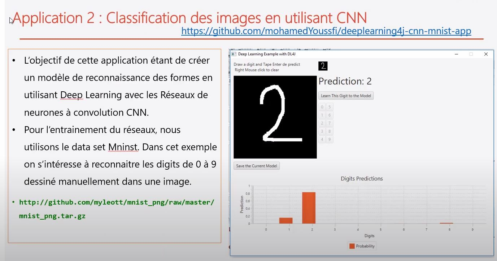


Fashio MNIST est une librairie de chaussure et vetement déja analyser prete à usage

tensorflow.keras est différents de  keras ( framework )

=     "optimizationAlgo" : "STOCHASTIC_GRADIENT_DESCENT" (SGD)

## La fonction de normalisation
**La fonction de normalisation** via la librarie **sklearn.proprocessing.StandardScaler**permet de reduire les trops grands écarts entre les valeurs et les reduire pour les raprochés vers 0 à 1.
z = (x - u) / s
où   **x** est l'échantillon **u** est la moyenne des échantillons d'apprentissage, et **s** est l'écart-type des échantillons d'apprentissage
```python
from sklearn.preprocessing import StandardScaler

..//..
# Reshape the dataset and convert to float Flatten
images = images.reshape(-1, 784)
images = images.astype(float)

scaler = StandardScaler()
images = scaler.fit_transform(images)
```


## cross entropy
 Cross entropy comme distance pour la descente de gradient.  
 La seconde étape est de réussir à minimiser la distance entre la solution calculée Y et la solution connue Y'. On pourrait choisir la distance euclidienne mais la littérature nous indique que le meilleur choix pour les classifications est la minimisation de la distance appelée entropie croisée (Cross Entropy
 
##  DesentGradient**


## Perceptron 


## MAE MSE RMSE


### quand utiliser MAE MSE  RMSE


## softmax

**une image**


**Un batch d'images**
Au lieu de faire une descente de gradient stochastique (une entrée à la fois), on utilise un batch d'un certain nombre d'entrées X en même temps. Deux avantages à cela, les contraintes sur le gradient représentent mieux une variété de possibilités puique l'on a plusieurs images en entrée et on travaillera sur de plus grandes matrices. En général sur les GPU, ces calculs matriciels sont plus facile à optimiser.

Par exemple pour un batch de 100 images en entrée on aura X[100,784] on aura la formule suivante:

Le "broadcasting" pour l'addition en python et numpy correspond à une extension de l'addition usuelle de matrices lorsque les dimensions ne correspondent pas. Ici par exemple la matrice des biais est répétée 100 fois pour que les dimensions concordent.


## One hot encode

## tendance
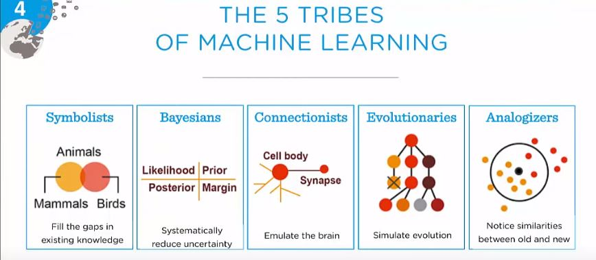
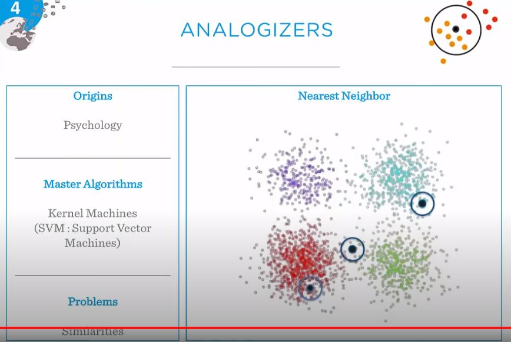
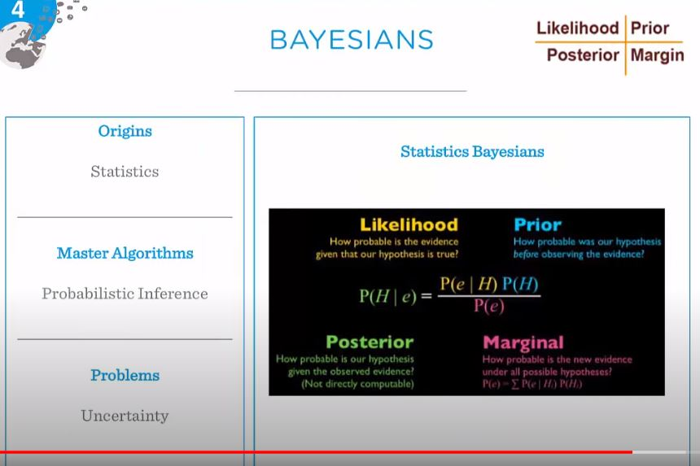
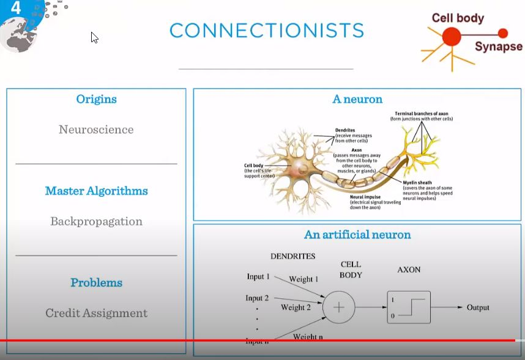
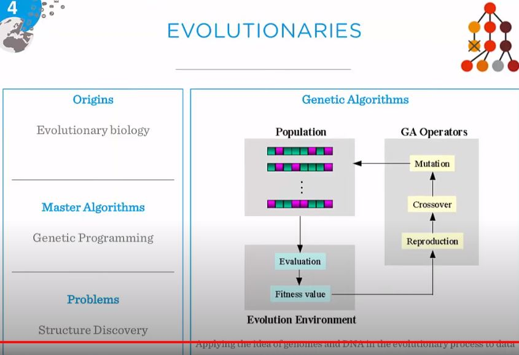
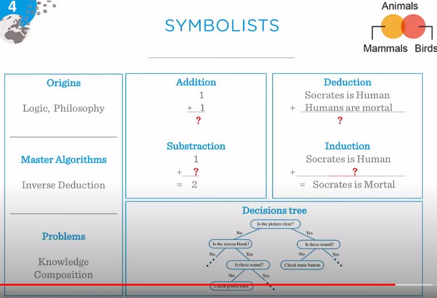


## CNN

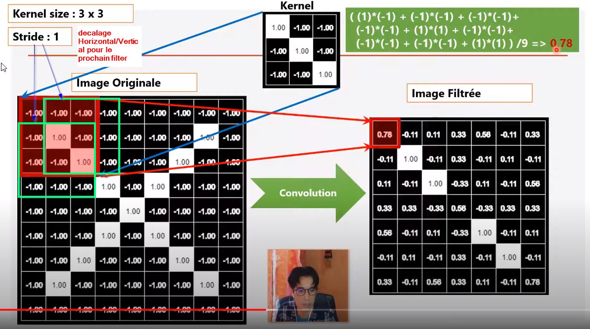

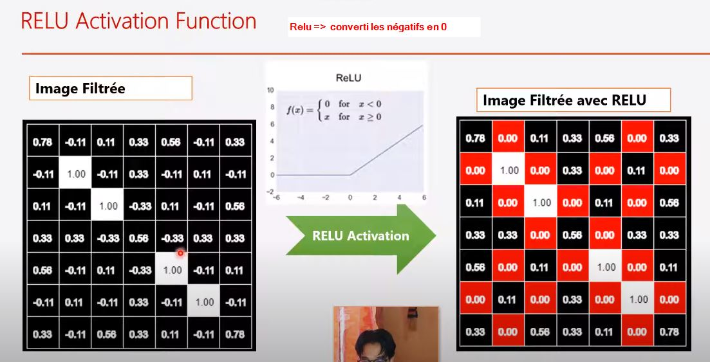

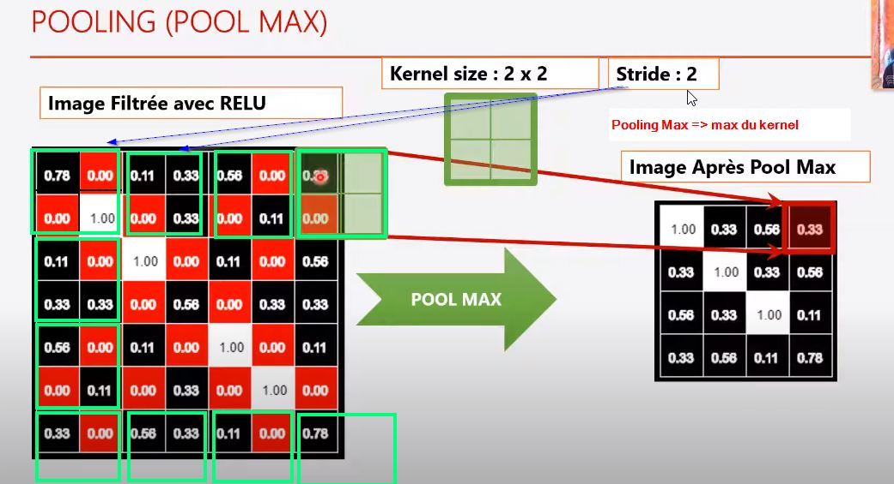

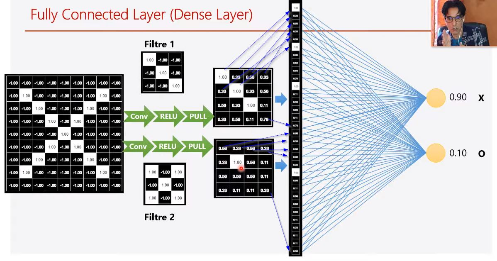


